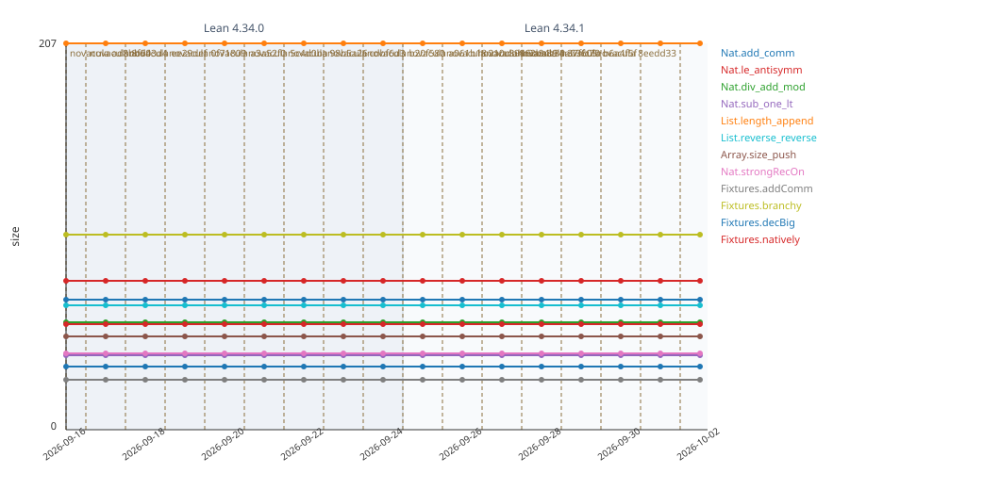

# Novacula

A deterministic complexity metric for Lean 4 proofs. Lower is better: a large gap between two
proofs of the same theorem should mean that one of them is much easier for a human to understand
completely.

The name comes from *novacula Occami*, Occam's razor. The metric rewards cutting away what a proof
does not need.

Novacula does not check proofs. Correctness is a precondition: `leanchecker` and nanoda must
accept the proof and its axioms must be in the sanctioned set, or Novacula reports no cost.

## The formula

The cost is recursive: every declaration a theorem reaches, down to the axioms, is costed by the
same rule. Fame decides how much of each one is charged:

```
w(T) = 1
w(v) = max over edges u → v of  w(u) · (1 − fame(u))

cost(T) = Σ over reachable d of  w(d) · ( fame(d) · cite(d) + (1 − fame(d)) · body(d) )
```

`body(d)` is the size of `d`'s kernel term and `cite(d)` the size of its statement.

- Citing a famous theorem costs about its statement; the proof behind it is barely charged.
- Citing a declaration nobody else uses costs about what copying its proof would, so splitting a
  proof across repositories to hide complexity gains nothing.
- Definitions follow the same rule. "Let f be continuous" is cheap, spelling out epsilon-delta is
  not, and a rarely used condition sits in between.
- A lemma reached along many paths is charged once.
- Computation is free, code is not. A `decide` over a range of 200 costs the same as over a range
  of 20, because a human accepts a finished check either way.

Raw metrics per declaration are cached per module and reused while the Lean version is unchanged.
Fame is applied only after all of them are known. `DESIGN.md` has the full model, the reasons
behind each rule, and the open questions.

## Metric history

The declarations in `targets.txt` are scored daily and appended to `data/history.csv`. Each shaded
band is one Lean version: a step at a band edge comes from the toolchain, while movement inside a
band comes from the proofs or from changes in the fame of what they cite.



## Use in a Lean project

Add a job to the project's CI, plus a schedule for periodic reruns:

```yaml
on:
  schedule:
    - cron: "0 6 * * 1"   # weekly

jobs:
  novacula:
    runs-on: ubuntu-latest
    permissions:
      contents: write
    steps:
      - uses: actions/checkout@v5
      - uses: RianKoja/novacula@v0.2.1
        with:
          theorems: all   # or title theorems: "Foo.main_theorem Foo.corollary"
```

Pin the action to a commit SHA (`RianKoja/novacula@<sha> # v0.2.1`) if the repository requires it;
Renovate and Dependabot update such pins when a new tag is released. The action pins the
actions it uses itself to commit SHAs as well.

The action builds the project, rebuilds Novacula and the checkers on the project's own toolchain,
and scores the selected theorems. Each run writes a table to the job summary. Runs on the default
branch (pushes, scheduled runs and manual runs) also update `history.csv`, `history.svg` and
`badge.svg` on a `novacula` branch, which the README can show:

```markdown


```

The badge shows the cost of all selected theorems scored together and the Lean version it was
computed on. Other inputs: `module`, `corpus`, `branch`, `push`, `nanoda-rev` (see `action.yml`).

## Local use

```
make test                                       # build and run the selftest
make score MODULE=Fixtures DECL=Fixtures.branchy
make track                                      # append today's metrics and redraw the chart
make chart                                      # redraw the chart only
```

To score another project, build Novacula with that project's `lean-toolchain` and run it inside
the project with the checkers configured:

```
LEAN4CHECKER=leanchecker NANODA=/path/to/novacula/scripts/nanoda-check \
LEAN4EXPORT=/path/to/lean4export NANODA_BIN=/path/to/nanoda_bin NOVACULA_CORPUS=Mathlib \
  lake env /path/to/novacula score MyProject MyProject.main_theorem
```

## Status

Built: correctness gate, term metrics, recursive cost with interim in-degree fame, raw-metric
cache, history chart, badge, and the GitHub Action. Next: syntax metrics, weight profiles, and a
fame snapshot with repository stars.
